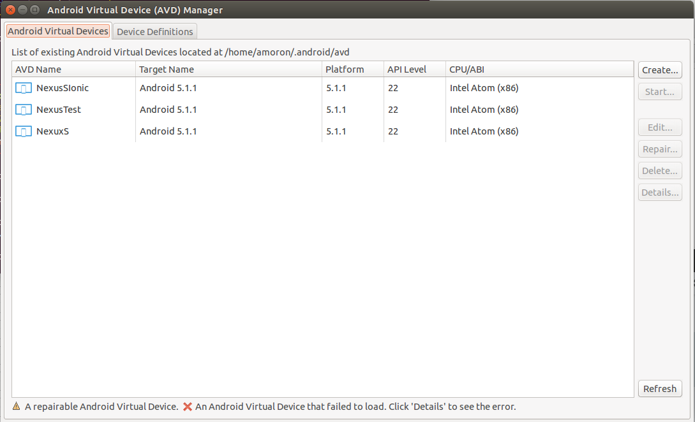
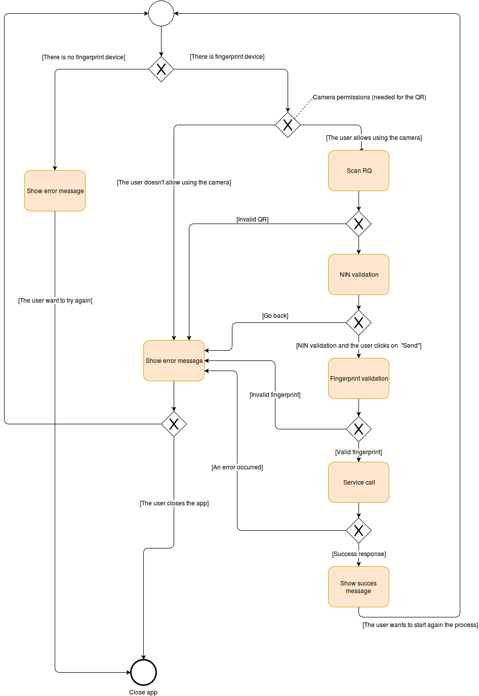

# se-leg-mobile

Mobile application developed in Ionic using [requionic](https://www.npmjs.com/package/generator-requionic).

## Table of Contents
  - [Requirements](#requirements)
  - [Installing projects dependencies](#installing-projects-dependencies)
  - [Working in an emulator](#working-in-an-emulator)
  - [Working with a connected USB device](working-with-a-connected-usb-device)
  - [App Workflow](#app-workflow)
  - [Profile the application](#profile-the-application)
  
## Requirements

If you want to contribute, you need to install:

  - NodeJS (>= 3.2.3)
  - Bower (>= 1.7.1)
  - Gulp (>= 3.9.0)
  - Cordova (>=6.2.0)
  - Ionic (>= 1.7.12)
  - Andriod SDK (>= 22): For this dependency, you will need Java >= 7 (Java 8 is the best option).
  
### NodeJS Installation

```
$ curl -sL https://deb.nodesource.com/setup_6.x | sudo -E bash -
$ apt-get install -y --no-install-recommends nodejs
```

### Bower Installation

```
$ npm install -g bower
```

### Gulp Installation

```
$ npm install -g gulp
```

### Android SDK Installation

Before installing the Android SDK, you maybe need to install some additional libs (depending on your distribution) to ensure that the SDK will work fine:

```
$ apt-key adv --keyserver keyserver.ubuntu.com --recv-keys EB9B1D8886F44E2A
$ apt-get update -y
$ apt-get -y --no-install-recommends install g++ lib32gcc1 lib32ncurses5 lib32stdc++6 lib32z1 libc6-i386 libgconf-2-4 libvirt-bin libxi6 make psmisc python python-software-properties qemu-kvm software-properties-common
```
Installing the Android SDK (Version 22)

```
$ wget --progress=dot:giga -O /opt/android-sdk-linux.tgz https://dl.google.com/android/android-sdk_r22-linux.tgz
$ tar xzf /opt/android-sdk-linux.tgz -C /tmp
$ rm /opt/android-sdk-linux.tgz
$ mv /tmp/android-sdk-linux /opt/android-sdk-linux
$ echo 'y' | /opt/android-sdk-linux/tools/android update sdk -s -u -a -t platform-tools,build-tools-22.0.1,android-23,android-22,sys-img-armeabi-v7a-android-22,sys-img-x86_64-android-22,sys-img-x86-android-22,sys-img-armeabi-v7a-google_apis-22,sys-img-x86_64-google_apis-22,sys-img-x86-google_apis-22,addon-google_apis-google-22,source-22,extra-android-m2repository,extra-android-support,extra-google-google_play_services,extra-google-m2repository
$ echo 'y' | $ANDROID_HOME/tools/android update sdk -s -u -a -t tools
```

After doing that, check if you have a zip file that matches with the pattern tools_*.zip in /opt/android-sdk-linux/temp/. If you have it, so move it into the tools directory and decrompress it:

```
$ mv /opt/android-sdk/linux/temp/tools_*.zip /opt/android-sdk/linux/tools.zip
$ unzip /opt/android-sdk/linux/tools.zip -d /opt/android-sdk/linux/
```

### Cordova Installation

Before installing Cordova, you should ensure you  have Java installed in your env. If you don't have it installed, you can do it just executing:

```
sudo apt-get install openjdk-8-jdk
```

Once you have Java installed, you will be able to install Cordova:

```
npm install -g cordova@6.2.0
```

If you want to install another version, you only need to change the @6.2.0 for the version you want to install or removing it to install the latest one.

### Ionic installation

```
npm install -g ionic@$1.7.2
```

If you want to install another version, you only need to change the @1.7.2 for the version you want to install.


## Installing projects dependencies
 
 To install all the needed libraries that are defined in the package.json and the bower.json you have to:
 
 ```
npm install
npm update
bower install
bower update
```

## Working in an emulator

To work in an emulator you need to create an emulator in the Android Virtual Device (AVD) Manager.



Once you have the emulator created, you will need to create the platform:

 ```
$ ionic platform add android
```

Once you have the plaftorm added, you will be able to start the emulator running:

 ```
$ ionic emulate -c -l
```

## Working with a connected USB device

Once you have your device connected, check that the device is connected:

```
$ adb devices
* daemon not running. starting it now on port 5037 *
* daemon started successfully *
List of devices attached 
420009a0c4ea7300	online
```

So, once the device is connected, you will be able to deploy your current development by running:


```
$ ionic platform add android
$ ionic run
```

## App Workflow



## Profile the application

This application has been built to allow composition. There are four base components that you can mix and match in order to define your own workflow. Once you have developed your own app version you can run the provided gulp tasks to get your application. While you are developing you can use the instructions shown before to run the application in your emulator or device just adding the profile you want to use as a parameter to the command.

```
$ ionic emulate -c -l --theme=se-leg
$ ionic run --theme=se-leg
```


[More on profiling](doc/PROFILES.md)

