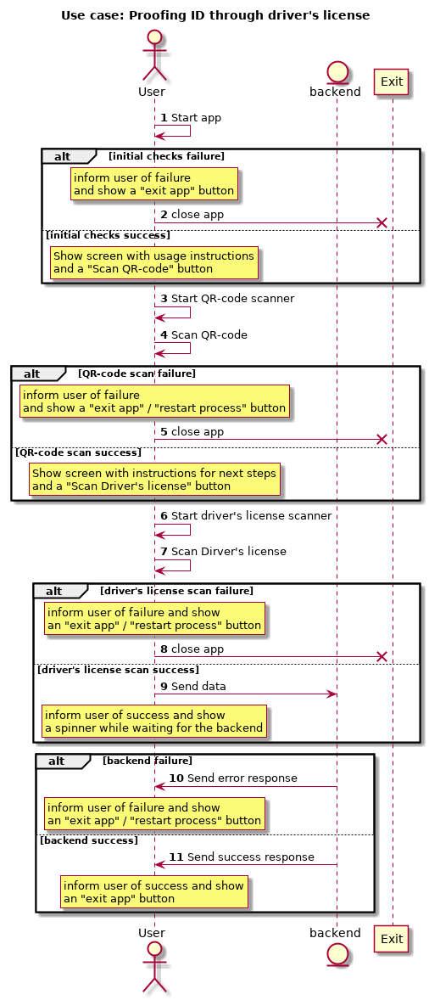

# NSTIC February demo use case

From the perspective of the mobile app, without distinguishing different parts in the backend.

## Preconditions:

* User has created an account and wants to proof the identity associated with the account.
* User has a QR-code with a nonce that identifies the created account (and possibly some additional data)

## Diagram

## User stories

1. As a user, I want to start the app, so that initialization checks all conditions needed for the app to work
2. Initialization result
  * 2a. Failure. As a user, when some necessary initial condition is absent, I want to be shown information about it, and a button to exit the app, so that I can use other means to fix the problem and then restart the app.
  * 2b. Success. As a user, when all initial conditions are satisfied, I want the app to inform me of the next steps to follow, and to offer me a button to follow them (start the QR-code scanner).
3. As a user, when I click on the "Scan QR-code" button, I  want the scanner to start, so that I can feed it the QR-code I had in my possesion.
4. As a user, I want to scan my QR-code, so that the app gathers the needed information about my account.
5. QR-code scan result
  * 5a. Irrecoverable failure. As a user, when some necessary condition is irrecoverably absent, I want to be shown information about it, and a button to exit the app, so that I can use other means to fix the problem.
  * 5b. Recoverable failure. As a user, when some necessary condition is recoverably absent, I want to be shown information about it, and a button to restart the scan, so that I can fix the problem and rescan the QR-code.
  * 5c. Success. As a user, when the QR-code scan has been successful, I want to be informed of it, and be informed of the next step, and be offered a button to start the next step (scan driver's license).
6. As a user, when I  have clicked the "scan driver's license" button, I want the app to start the driver's license scanner, so I can feed it my driver's license.
7. As a user, I want to scan my driver's license, so that the app gathers enough information to identify me.
8. Driver's license scan failure
  * 8a  & 8b like 5a & 5b
9. Driver's license scan success
  * 9a. As a user, when the driver's license scan is successful, I want to be informed of it, 
  * 9b. As a user, when the app has my identification data and my account data, I want it to send that information to the backend, so that my account may be vetted, and I want to be informed (a spinner) that I have to wait for the response..
10. Proofing fails
  * 10a & 10b as 5a & 5b
11. As a user, when the proofing process finishes successfully, I want to be informed of it, and offered a button to exit theapp.

